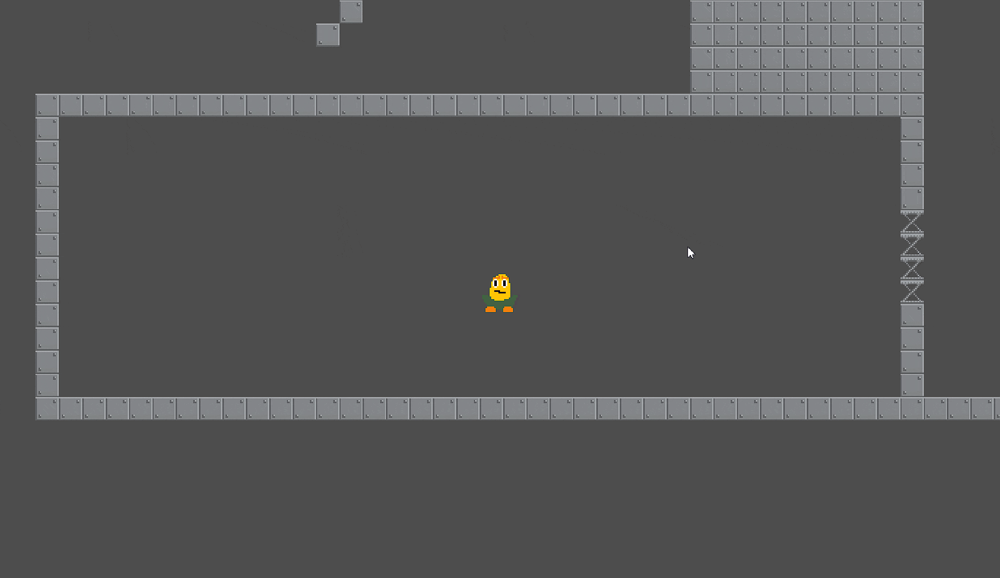
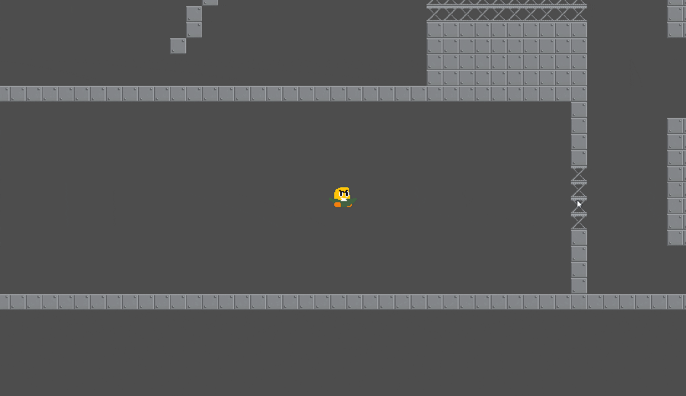

# Rogue-lite Prototype

A top-down rogue-lite with advanced movement and collision mechanics (In Progress)

# Features
- Character state machine (idle, walk, charge, slide, charged_slide, stun)
- Physics-based collision detection (speed + angle aware)
- Destructible walls triggered by charged attacks
- Custom sprite animations

## Controls
- **WASD** — Move / Walk  
- **Shift** — Charge attack  
- **Right Click or Shift (while charging)** — Slide / Exit charge  
- **Hold Shift (while charging)** — Maintain momentum (Note: you must release shift after charging then press again and hold)

## How to Run
1. Download the latest `Corn.exe` from the Releases section.
2. Run the executable.
3. Enjoy the prototype!